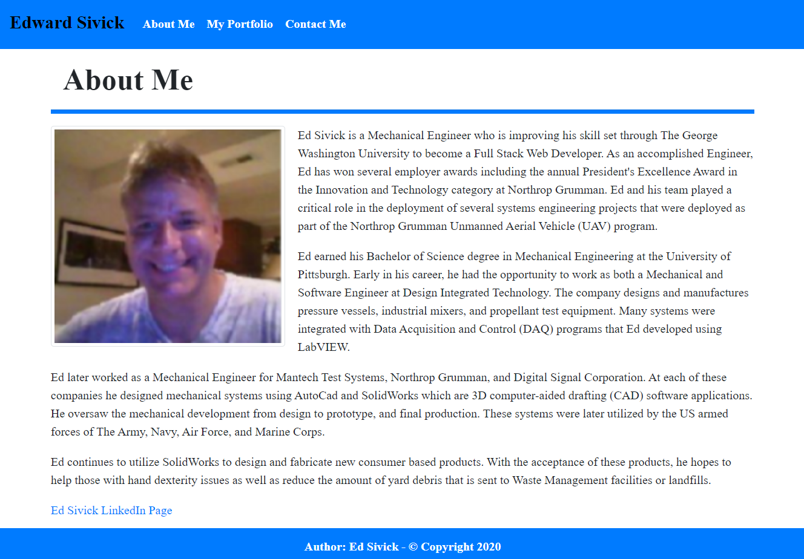
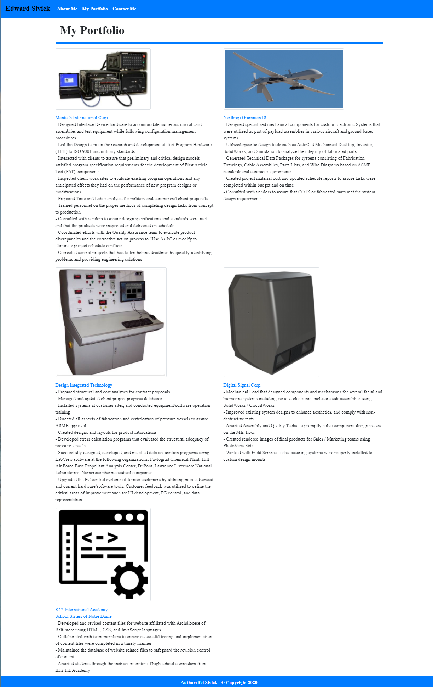
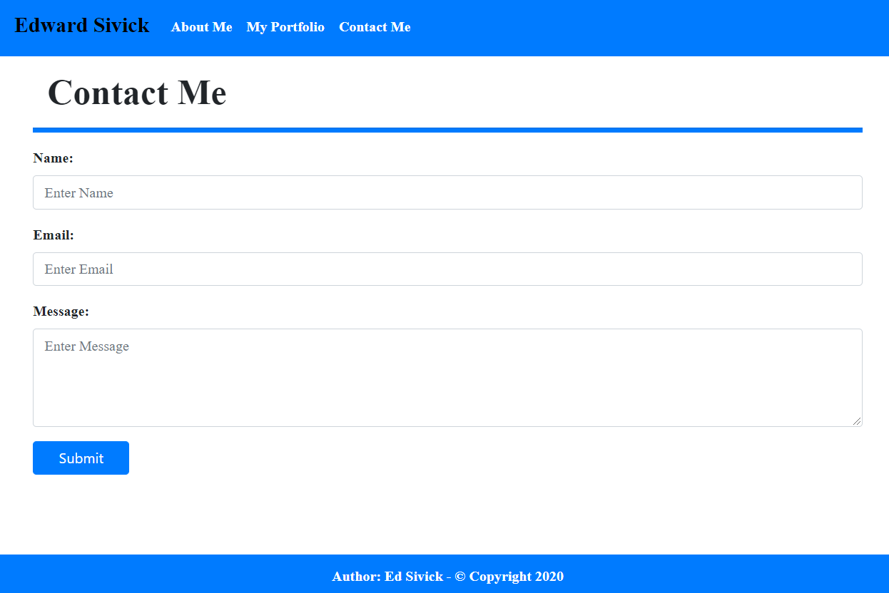

# Project Title: CSS and Bootstrap Responsive Portfolio
___
## Objective
The objective of this task was to create a mobile responsive portfolio using the Bootstrap CSS Framework.  The portfolio site includes the following files: `index.html`, `portfolio.html` and `contact.html`.
Each file is to have the following items:
- **A navbar**
- **A responsive layout**
- **Responsive images**

On an `xs` screen, the content of each web page is to take up the entire screen.  On `sm` and larger screens, the web pages are to have some margins on the left and right sides of the screen.
___
## Layout: index.html
The content of this page displays a brief personal history of my education, career accomplishments, and a link to my LinkedIn page.
The html code includes the following:
- semantic elements
- a Bootstrap navbar was modified to display my name along with links to `index.html`**(About Me)**, `portfolio.html` **(My Portfolio)**, and `contact.html` **(Contact Me)**
- a Bootstrap grid system that has a container with two rows.  Row 1 has one column, **col-md-12** (header).  Row 2 has one column, **col-md-12** (image and text).
- a responsive layout that adjusts the images and text when the screen is re-sized
- a sticky footer that displays the Author and Copyright year

## Layout: portfolio.html
The content of this page illustrates work-related tasks and associated images from previous employers.  A link to the employer website is added below each image.  
The html code includes the following:
- semantic elements
- the navbar code from the `index.html` file was copied and added to this file. 
- a Bootstrap grid system that has a container with four rows, and two columns in each row.  Row 1 has one column containing the header,  **col-md-12**.  Rows 2 through 4 have two equal columns in each row, **col-md-6** (one containing image, and one containing text). Row 4, column 2 is intentionally empty since there was no additional content to add.
- a responsive layout that adjusts the images and text when the screen is re-sized
- the sticky footer code from the `index.html` file was copied and added to this file.

## Layout: contact.html
The content of this page contains a contact form that allows the user to submit their name, email, and a message.
The html code includes the following:
- semantic elements
- the navbar code from the `index.html` file was copied and added to this file.
- a Bootstrap grid system that has a container (for the contact form) inside of a container (main). Each container has 1 row.  The row for the (main) container has 1 column containing the header, and the 1 row for the (contact form) includes the pre-coded form content, both are **col-md-12**.
- a responsive layout that adjusts the images and text when the screen is re-sized
- the sticky footer code from the `index.html` file was copied and added to this file.

## Styling: style.css
- The appearance of the **navbar** in the 3 html files was modified.
- The **h1** text for the 3 html files was modified.
- The **hr** horizontal ruler for the 3 html files was modified.
- The right and bottom margins for images in the `index.html` and `portfolio.html` files were changed.
- The fonts and **Submit** button in the `contact.html` file were changed.
- **margin-bottom** was added to the **btm-margin** div class in the `index.html` and `portfolio.html` files to add spacing above the footer.
- The appearance of the **footer** in the 3 html files was changed.
- A **media query** was added to change the content appearance below 576px: 
- change background color
- re-size all images to utilize the full viewport 
- set main div left/right margins to zero
___
## Summary
Bootstrap is a valuable CSS framework that allows web developers to save time creating dynamic content by adding pre-coded components to their HTML code. It also permits developers to customize the appearance of the components through editing the HTML code, and/or by adding additional styling through CSS. The grid system provides the ability to create more responsive websites, allowing users to view content on various screen sizes.  As a humorous comparison, Bootstrap is to web developers as "TV Dinners" is to "too busy to cook" consumers.
___
## Application Links and Images  
**Links:**  
Application link: (https://ed-sivick.github.io/2-responsive_portfolio/develop/index.html)    
index.html code: (https://github.com/ed-sivick/2-responsive_portfolio/blob/master/develop/index.html)  
portfolio.html code: (https://github.com/ed-sivick/2-responsive_portfolio/blob/master/develop/portfolio.html)    
contact.html code: (https://github.com/ed-sivick/2-responsive_portfolio/blob/master/develop/contact.html)  
style.css code: (https://github.com/ed-sivick/2-responsive_portfolio/blob/master/develop/assets/css/style.css) 

**Application Image Examples:** Hover the mouse over each image for a brief description. 

  
  
  

  
  
